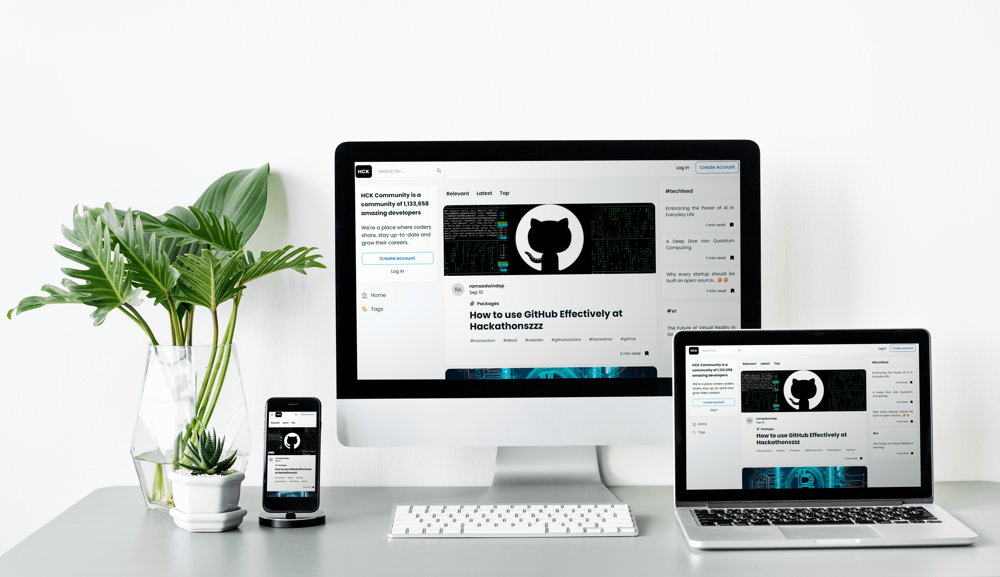

<h1 align="center"> Hck_Community </h1>

<h4 align="center">HCK_Community is a Web App social network for software developers, inspired by the aesthetic of dev.to. It allows users to view articles on a wide range of topics related to software development, technology, programming, and more.</h4>

  <a href="#techstack">Techstack</a> •
  <a href="https://hck-site.web.app/">Demo (admin)</a> •
  <a href="https://hck-community.web.app/">Demo (client)</a> •
  <a href="#info">Info</a> 

## Techstack

This software uses the following open source packages: React.js, Redux, Express, Sequelize, Tailwind CSS, HeadlessUI, PostgreSQL, Redis, AWS EC2, JsonWebToken, Bcrypt.js.

## Info

You're ready to go! <a href="https://hck-site.web.app/">HCK-Site (admin)</a> in your browser, and login with:

- **Username:** admin@hck.com
- **Password:** admin
